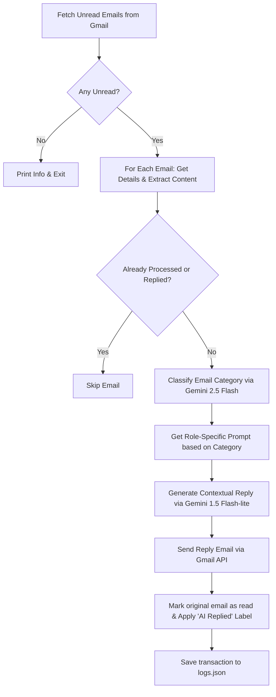

# AI Email Automation with Python

This project provides an automated AI-powered agent that monitors a Gmail inbox for unread emails, classifies them into specific categories, generates personalized contextual replies using the Gemini API, replies to the sender, and tags/logs the transactions to prevent duplicate replies.

---

## 🛠️ Architecture & Project Structure

The project is structured modularly, separating concerns between API interfaces, classification/reply generation, prompting, logging, and application control:

```
AI_Email_automation/
│
├── config/
│   ├── credentials.json      # Google Cloud / Gmail API OAuth 2.0 Credentials (User provided)
│   └── token.json            # Auto-generated OAuth 2.0 User access token after authentication
│
├── app.py                    # The main execution script and pipeline orchestrator
├── gmail_services.py         # Handles Gmail authentication, fetching, parsing, and tagging emails
├── email_sender.py           # Prepares and sends draft replies via Gmail
├── ai_service.py             # Generates contextual email replies using Gemini 1.5 Flash-lite
├── email_classifier.py       # Classifies emails into categories using Gemini 2.5 Flash
├── email_context.py          # Formats email data into clean contexts for the LLM
├── prompt.py                 # Houses role-based system prompts (Sales, HR, Support, etc.)
├── prompt_selector.py        # Selects the appropriate prompt based on the classified category
├── logger.py                 # Handles JSON-based audit logging (logs.json) to prevent double-processing
├── requirements.txt          # Python dependency specifications
├── .env                      # Environment variables storing API keys
└── decode.py                 # Utility script to encode/decode Google Cloud credentials
```

---

## 🔄 Core Workflow

When you run `python app.py`, the following sequence executes:



---

## 📄 File Descriptions

### 🚀 Entry Point
* **[app.py](file:///c:/Users/aravi/Projects/AI_Email_automation/app.py)**: The orchestrator. It fetches inbox entries, checks if they have been processed already, directs the classification and generation stages, handles failures gracefully, transmits the replies, and manages labels and logging.

### 📧 Gmail Integration & Messaging
* **[gmail_services.py](file:///c:/Users/aravi/Projects/AI_Email_automation/gmail_services.py)**: Manages OAuth 2.0 flow with Google. Decodes Base64 payloads, sanitizes HTML to text (using `BeautifulSoup4`), extracts attachments presence, checks if the thread was already replied to, and handles label modifications.
* **[email_sender.py](file:///c:/Users/aravi/Projects/AI_Email_automation/email_sender.py)**: Wraps raw email data into proper `MIMEText` structures, sets headers (such as threading matching via `In-Reply-To` parameters), and dispatches it over Gmail's raw sending endpoint.

### 🧠 AI & LLM Components
* **[email_classifier.py](file:///c:/Users/aravi/Projects/AI_Email_automation/email_classifier.py)**: Passes email subject and body to the `gemini-2.5-flash` model to categorize it into one of: `GENERAL`, `HR`, `INTERVIEW`, `CUSTOMER_SUPPORT`, `COMPLAINT`, `SALES`, or `LEAVE_REQUEST`.
* **[ai_service.py](file:///c:/Users/aravi/Projects/AI_Email_automation/ai_service.py)**: Interfaces with `gemini-3.1-flash-lite` to compose clean, professional, and contextually matching replies based on the selected prompt category.
* **[prompt.py](file:///c:/Users/aravi/Projects/AI_Email_automation/prompt.py)**: Stores role-specific prompts tailored for each business domain (e.g., persuasive for Sales, empathetic for Customer Support, policy-adherent for HR).
* **[prompt_selector.py](file:///c:/Users/aravi/Projects/AI_Email_automation/prompt_selector.py)**: Simple routing logic linking the classifier output to the prompt template.
* **[email_context.py](file:///c:/Users/aravi/Projects/AI_Email_automation/email_context.py)**: Constructs structured user queries containing sender metadata and message body.

### 📝 Utility & Logging
* **[logger.py](file:///c:/Users/aravi/Projects/AI_Email_automation/logger.py)**: Performs quick checkups on a local database file `logs.json` to prevent re-processing emails that have already received automated responses.
* **[decode.py](file:///c:/Users/aravi/Projects/AI_Email_automation/decode.py)**: Helper to convert credentials files to base64 encoding strings when configuring deployment servers.

---

## ⚙️ Configuration & Installation

### 1. Prerequisites
Ensure you have Python 3.10+ installed.

### 2. Install Dependencies
```bash
pip install -r requirements.txt
```

### 3. Setup Gemini API Key
Create a `.env` file in the root directory:
```env
GEMINI_API_KEY=your_actual_gemini_api_key_here
```

### 4. Enable Google Gmail API & Setup OAuth
1. Go to the [Google Cloud Console](https://console.cloud.google.com/).
2. Create a new project and enable the **Gmail API**.
3. Configure the **OAuth Consent Screen** (specify User Type: External, and add your test email addresses).
4. Create **OAuth 2.0 Client Credentials** (Desktop Application type).
5. Download the credentials JSON, rename it to `credentials.json`, and place it in the `config/` directory.

---

## 🏃 How to Run

Execute the main program:
```bash
python app.py
```

*On the first run, a browser window will open requesting permissions to read, modify, and send emails from your Gmail inbox. Once authorized, it will download a `token.json` file to the `config/` folder so subsequent runs can run headlessly.*
